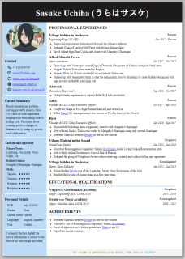

# Jinja Resume

A resume generation utility using [jinja templates](https://jinja.palletsprojects.com/) with HTML and css.

Example (click to view full):

<a href="https://rahulsrma26.github.io/jinja-resume/" target="_blank"></a>

For live preview the dev environment is build using [fastapi](https://fastapi.tiangolo.com/) and hot-reload is supported using [arel](https://github.com/florimondmanca/arel).

Features:

- jinja macros for managing generated html
- css with predefined `A4` sheet variables and print support
- [tabler/icon](https://github.com/tabler/tabler-icons) included
- Uses [BeautifulSoup](https://beautiful-soup-4.readthedocs.io/en/latest/) to "prettify" output file (`index.html`)

---

## Installation

1. Clone repo
   ```sh
   git clone https://github.com/rahulsrma26/jinja-resume.git
   cd jinja-resume
   ```
2. (Optional) Create and use new environment
   ```sh
   conda create -n py39 python=3.9 pip
   conda activate py39
   ```
3. Install dependencies
   ```sh
   pip install -r requirements.txt
   ```

---

## Development

```sh
python -m src.run dev ./data/profile.json
```

Use `-r` (or `--reload`) option for hot reloading. You can also use multiple json files they will be merged together (later files will override previous value if duplicate exists). It will be useful for saving private information that you don't wanna upload.

```sh
python -m src.run dev -r ./data/profile.json ./data/private.json
```

`private.json` is already included in `.gitignore` so it won't be uploaded to github.

It will create a `localhost` server

```sh
SET DEBUG="True" && uvicorn src.main:app --reload --port 8000
INFO:     Will watch for changes in these directories: ['jinja-resume']
INFO:     Uvicorn running on http://127.0.0.1:8000 (Press CTRL+C to quit)
INFO:     Started reloader process [20960] using WatchFiles
INFO:     Started server process [1184]
INFO:     Waiting for application startup.
INFO:     Application startup complete.
```

---

## Build

```sh
python -m src.run build -r ./data/profile.json
```

This will create static files in the `build` folder.
